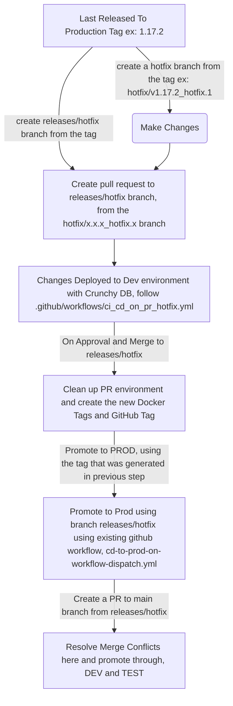

| Service in Monorepo | SonarCloud                                                                                                                                                                                                                                                                                                                                                                                                                                   |
| ----------------- | -------------------------------------------------------------------------------------------------------------------------------------------------------------------------------------------------------------------------------------------------------------------------------------------------------------------------------------------------------------------------------------------------------------------------------------------- |
| frontend          |                                   |
| admin-frontend    |                       |
| backend           |                                       |
| doc-gen-service   |       |
| backend-external  |   |

# Pay Transparency Reporting Tool

Pay Transparency Reporting Tool is a webapp that employers use to generate a pdf report. The [Gender equity - Pay transparency](http://https://www2.gov.bc.ca/gov/content/gender-equity/pay-transparency-in-bc "Gender equity - Pay transparency") website has more information and a link to the tool.

## Key Technologies Used

- OpenShift and helm charts
- PostgreSQL and Prisma
- node.js
- Vue and Vuetify
- Vite
- jest, vitest, and playwright
- ESLint and Prettier
- SonarCloud

## GitHub Actions

### Automatic actions

- Pull requests automatically create a temporary instance on OpenShift and are automatically removed when merged to main
- Unit tests, integration tests, and end-to-end test are automatically performed.
- SonarCloud scans

### Manual actions

- Deploy to Test environment
- Deploy to Prod environment

## Local Environment Setup

### Prerequisites

1. BC Gov VPN
1. Keycloak and BCeID authorization
1. Podman (or equivalent for running docker containers)
1. Node.js
1. Ports need to be available for the application to work locally
   - 8081 frontend
   - 8084 admin-frontend
   - 3000 backend
   - 3001 doc-gen-service
   - 3002 backend-external
   - 3011 clamav-service ( node.js api)
   - 3310 clamav (clamav daemon)
   - 5432 postgres

### Repo setup

1. Clone repo

1. Create and populate environment variable files

   `/backend/.env`

   `/frontend/env.js`

1. (Optional) A VSCode workspace is provided in .vscode/fin-pay-transparency.code-workspace which can easily install npm packages and launch all services.

1. Install npm packages for each project in repo

   `npm -C backend ci`

   `npm -C backend-external ci`

   `npm -C doc-gen-service ci`

   `npm -C frontend ci`

   `npm -C admin-frontend ci`

1. Build and start the database container

   `podman-compose up --build -d database`

1. Run the database migrations to create/update the database for this project

   `podman-compose up -d database-migrations`

### Start servers

- The backend requires the doc-gen-service and the database docker container to be running.
- The backend-external requires the backend service to be running.
- The frontend requires the backend to be running in order to login.

`npm -C backend run dev`

`npm -C backend-external run dev`

`npm -C doc-gen-service run dev`

`npm -C frontend run serve`

`npm -C admin-frontend run serve`

### Tests

#### Unit

All projects have unit tests and can be run with

`npm run test`

#### Integration

Only backend-external has integration tests. Requires that backend-external and backend services be running.

`npm run test:integration`

#### End-to-end

The frontend end-to-end test is performed by playwright.

1. Install playwright tools:

   `npx playwright install --with-deps`

1. Create and populate environment variable file

   '/frontend/.env.playwright'

1. Run the tests:

   `npm run e2e`
## Hotfix Process

